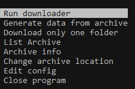
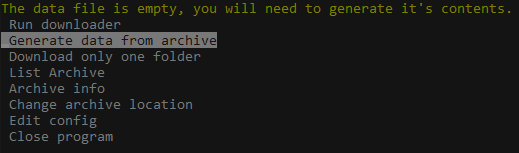

# e6AutoArchive

A console program that lets you update your huge collection of images from e621.

## Usage

First set up a folder filled with subfolders named after tags from e621. These folders should be empty unless the files within are stored the same way e6AA stores them (`<id>_<md5>.<ext>`). In the below example the folder is named "archive" and is filled with some example subfolders.

Then put the exe in another folder outside of your archive folder.

IMPORTANT: If your archive folder is named something else and/or is in a different relative location from the exe you will have to specify this in the `config.json` file. This file will be generated in the same place as the exe once you open it for the first time. You can also change this through the console menu that the program provides.

If everything is set up correctly you should now choose the "Generate data from archive" option. You will need to choose this option whenever you make changes to your archive folder such as adding a new folder or removing one.

If everything went right you can now choose the "Run downloader" option and the subfolders will start filling up with files from e621 that contained tags that match the folder's name.

At any time after using the program you can re-open it and run the downloader again to automatically update your archive without wasting time redownloading images you already have.
The program fetches and downloads images as fast as it can without triggering e621's rate limit.

## Info

This program was made out of annoyance with most downloaders that only let you do one query at a time. After some time with a collection large enough this becomes pretty impractical and so I made this program to make things (hopefully) easier.

There are FAR better programs that solve that problem such as Grabber (as it lets you have a download list) but if you only download files from e621 and don't need all those bells an whistles then this program might be an okay alternative, and there is also the upside of not wasting time checking each file to see if it already exists.