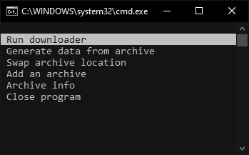

# e6AutoArchive

A console program that lets you more easily make and maintain large collections of media from a *certian blue website* =3=

&nbsp;&nbsp;&nbsp;

&nbsp;&nbsp;&nbsp;

- This program downloads **porn** from https://e621.net.
- Specifically made to manage a fairly large collection **and keep it up to date** with ease.
- Instead of inputting tags, you **name folders after tag searches** to be automatically filled with the appropriate content.
- **Faster than other programs** since it doesn't need to redundantly check every file to see if it exists.
- You don't have to install Python since I made this in JavaScript.
- I didn't use a morbillion libraries to make this.
- Null links are reconstructed so **you don't ever need to provide a username or api key**.
- No telemetry.

# Usage

Create a folder with two folders in it, one will contain your 'archive' and the other will contain the executable program provided in [releases](https://github.com/snebl/e6AutoArchive/releases).

> In this example, the archive folder is named "archive" and the "example" folder contains the exe program.

If want your archive folder to be named something else and/or want it in a different relative location from the exe you will have to specify this in the `config.json` file under `archives[0].folder` as shown in the image below. The config file will be generated in the same place as the exe once you open it for the first time.

> Dot notation for directories :  
`./` means "in this folder."  
`../` means "in the folder containing this folder."  
`../../` would mean "in the folder containing the folder that contains this folder."

Fill the archive folder with subfolders named after tags from e621. <ins>These folders should be empty</ins>. If you already have media from e621 saved I recommend you store it separately or at the very least have the latest file's name start with it's post ID and then an underscore, like `<id>_<rest of filename>`.

If everything is set up correctly you should now open the exe choose the "Generate data from archive" option. You will need to choose this option whenever you make changes to your archive folder such as adding a new folder or removing one.

> The program tries to find the file with the largest ID number in each folder when you 'generate data', these numbers are written to a JSON file so that no time is wasted comparing files that you already have when downloading. The one downside to doing it this way is that if an **older** file is missing then the program won't know about it and therefore won't automatically re-download it like other programs do. Fortunetly files don't just spontainiously dissapear (I think), and e621 will never re-use an older ID number even if the post is of older media.

If everything went right you can now choose the "Run downloader" option and the subfolders will start filling up with files from e621 that contained tags that match the folder's name.

---

Any time after using the program you can re-open it and run the downloader again to **automatically update your archive** without redownloading images you already have.
The program fetches and downloads images as fast as it can without triggering e621's rate limit.

> **If you add or remove any folders**, make sure to run the "generate data from archive" command before running the downloader again.

---

If you have everything set up and would like to automate the program with batch you can use the launch option `-g` to generate data, or `-r` to run the downloader, without having to use the menu. Passing both will generate data and then run the downloader.

---

If you have an issue or feel that something about the program should be different then please submit an issue or pull request, or just DM me on discord for a much faster response (linked on my profile).

P.S. Do not run multiple instances of this program at the same time, e621 will rate limit you and it will not function properly.

## Adding multiple archives

The "Add an archive" option can be used to add more locations where files can be downloaded. In this example the new archive is inside of the old one but keep in mind it can be wherever.

You can also add a location (and data file) manually through the `config.json` file.

# Compiling to macOS/Linux

If you aren't using a windows machine you can use [pkg](https://www.npmjs.com/package/pkg) or something similar to compile the project's source code into an executable for your preferred operating system.

# Info

This program was made out of annoyance with most downloaders that only let you do one query at a time. When you have a large enough collection this becomes pretty impractical. There are much fancier programs that solve this problem such as Grabber since it lets you have a download list, but it can be slow waiting for it to compare each pre-existing file, and tedious to make the download list manually. e6AA uses the folders in your archive as the list and keeps track of post IDs to avoid checking every file. All this to make mass downloading furry porn much easier.
