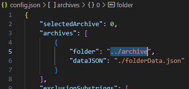

# e6AutoArchive

- This program downloads **porn** from https://e621.net.
- It's specifically made to manage a fairly large collection with ease.
- Instead of inputing tags, you name folders after them to be automatically filled with the appropriate content.
- Faster than other programs since it doesnt need to redundantly check every file to see if it exists.
- I didn't use a morbillion libraries to make this.
- You don't have to provide a username or api key.
- No telemetry.

# Usage

Create a folder with two folders in it, one will contain your archive and the other will contain the provided exe. (in this example, the archive folder is named "archive" and the "example" folder contains the .exe)

If want your archive folder to be named something else and/or want it in a different relative location from the exe you will have to specify this in the `config.json` file under `archives[0].folder` as shown in the image below. The config file will be generated in the same place as the exe once you open it for the first time.

Fill the archive folder with subfolders named after tags from e621. These folders should be empty unless the files within are stored like `<id>_<md5>.<ext>`.

If everything is set up correctly you should now open the exe choose the "Generate data from archive" option. You will need to choose this option whenever you make changes to your archive folder such as adding a new folder or removing one.

If everything went right you can now choose the "Run downloader" option and the subfolders will start filling up with files from e621 that contained tags that match the folder's name.

---

Any time after using the program you can re-open it and run the downloader again to automatically update your archive without redownloading images you already have.
The program fetches and downloads images as fast as it can without triggering e621's rate limit.

> If you add or remove any folders, make sure to run the "generate data from archive" command before running the downloader again.

---

If you have everything set up and would like to automate the program with batch you can use the launch option `-g` to generate data, or `-r` to run the downloader, without having to use the menu. Passing both will generate data and then run the downloader.

---

If you have an issue or feel that something about the program should be different then please submit an issue or pull request.

P.S. Do not run multiple instances of this program at the same time, e621 will rate limit you and it will not function properly.

## Adding multiple archives

The "Add an archive" option can be used to add more locations where files can be downloaded. In this example the new archive is inside of the old one but keep in mind it can be wherever.

You can also add a location (and data file) manually through the `config.json` file.

# Building ( non-windows users )

Use [pkg](https://www.npmjs.com/package/pkg) or something similar.

# Info

This program was made out of annoyance with most downloaders that only let you do one query at a time. After some time with a collection large enough this becomes pretty impractical and so I made this program to make things (hopefully) easier.

There are FAR better programs that solve that problem such as Grabber (as it lets you have a download list) but if you only download files from e621 and don't need all those bells an whistles then this program might be an okay alternative, and there is also the upside of not wasting time checking each file to see if it already exists.
